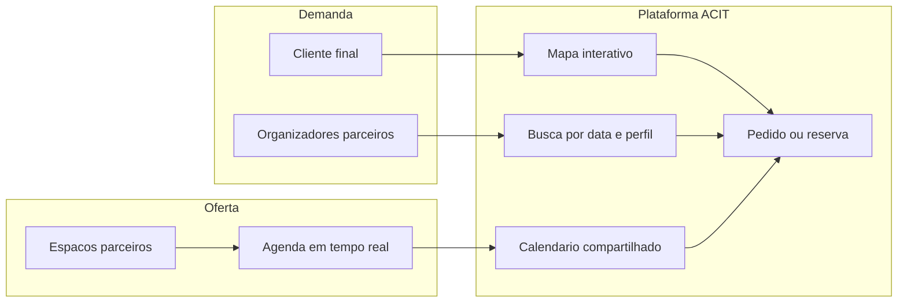

# Mapa de planejamento — disponibilidade centralizada de espaços para eventos (ACIT)

## O problema em uma frase

Quem busca um local hoje liga/WhatsApp um a um; quem recebe a consulta gasta tempo sem converter; **~30% desistem** e as equipes comerciais perdem **+1.700 h/ano**. A solução não é “mais um site de anúncios”: é **tornar a disponibilidade pública, confiável e acionável em segundos**.

---

## Como o PeerSpace funciona (referência)

O PeerSpace é um marketplace bilateral (EUA/global), frequentemente descrito como “Airbnb de espaços por hora”:

| Papel                     | O que faz                                                                                                    |
| ------------------------- | ------------------------------------------------------------------------------------------------------------ |
| **Anfitrião (espaço)**    | Cadastra local, fotos, preço/hora, regras, agenda; aceita ou recusa pedidos; recebe pagamento via plataforma |
| **Cliente (organizador)** | Busca por cidade, tipo de atividade, capacidade, preço e **data disponível**; reserva e paga no app          |
| **Plataforma**            | Conecta os dois, processa pagamento, suporte, confiança (seguro/garantia) e cobra comissão                   |

**Mecânica típica:**

1. Listagem gratuita do espaço
2. Preço por hora (ou dia), mínimo de permanência, add-ons (limpeza, equipamentos)
3. Agenda do anfitrião + sync com outros calendários
4. Dois modos de reserva: **pedido de aprovação** ou **Instant Book** (confirma na hora se a data estiver livre)
5. Receita: comissão do anfitrião (~20% do booking) + taxa de processamento do cliente
6. Confiança: avaliações, mensagens internas, seguro/garantia de danos

**O que o PeerSpace resolve bem:** descoberta + reserva + pagamento em um só fluxo.  
**O que ele não é (e abre espaço para vocês):** plataforma brasileira alinhada a entidades locais (ACIT), calendário **entre parceiros** (rede de espaços), e prioridade absoluta em **“quais locais estão livres nesta data”** como dor #1 do mercado local — não só “encontre um espaço bonito”.

---

## O que fazer de semelhante (núcleo do produto)

Copiar o que já funciona no PeerSpace, sem reinventar o óbvio:

1. **Cadastro de espaços** — fotos, capacidade, tipo de evento, comodidades, regras, preço base
2. **Agenda viva** — bloqueios, reservas confirmadas, janelas livres (fonte única da verdade)
3. **Descoberta** — mapa + filtros (data, capacidade, bairro, tipo de evento, preço)
4. **Fluxo de reserva** — consulta → disponibilidade → pedido/confirmação → comunicação
5. **Confiança** — perfil do espaço, histórico, avaliações, regras claras de cancelamento
6. **Visibilidade comercial** — menos “ligação fria”; mais leads qualificados com data e perfil do evento

---

## Diferencial central proposto (além do PeerSpace)

### 1. Calendário compartilhado de parceria (não só agenda individual)

No PeerSpace, cada espaço gerencia a própria agenda. Aqui, o diferencial é a **rede ACIT**:

- Parceiros (espaços + organizadores) entram em um **sistema de parceria entre cadastros**
- Quando o espaço A está ocupado na data X, o cliente (ou o organizador) vê **alternativas parceiras livres** na mesma região/perfil — sem recomeçar a busca do zero
- Organizadores de eventos podem ter **visão multi-espaço** (“preciso de 3 opções para o dia 15”) e encaminhar propostas em lote
- Reduz desistência: a resposta deixa de ser “não tenho” e passa a ser “não tenho, mas estes 3 parceiros têm”

### 2. Disponibilidade-first (anti-desistência)

UX pensada ao contrário do marketplace genérico:

- Entrada principal: **“Quando você precisa?”** → mapa só com locais livres
- Indicador claro no mapa: livre / parcial / indisponível
- Meta de produto: **resposta em minutos, não em dias de WhatsApp**

### 3. Âncora institucional ACIT (confiança local)

- Selo / rede de núcleos de espaços da ACIT
- Governança de qualidade (padrões mínimos de cadastro e atualização de agenda)
- Posicionamento: **infraestrutura comercial da cidade**, não só startup de aluguel

### 4. Brasil-first (fricção zero no uso real)

- Fluxos pensados para WhatsApp (notificação / deep link / compartilhar disponibilidade)
- Pagamento e emissão alinhados à realidade local (PIX, parcelamento, NF — fase posterior)
- Linguagem e tipos de evento locais (formatura, confraternização, casamento, corporativo, feira, show)

### 5. Alívio mensurável da operação comercial

Dashboard para espaços e para a rede:

- Consultas evitadas (horas economizadas)
- Taxa de conversão consulta → reserva
- Taxa de “desistência por demora” antes vs depois  
(Isso vira argumento de venda do próprio projeto perante a ACIT e os núcleos.)

---

## Papéis no ecossistema

| Papel                    | Necessidade                         | Valor que a plataforma entrega             |
| ------------------------ | ----------------------------------- | ------------------------------------------ |
| **Cliente final**        | Achar local livre rápido            | Mapa + data + comparação                   |
| **Espaço / núcleo**      | Menos consulta inútil, mais reserva | Agenda pública + leads qualificados        |
| **Organizador parceiro** | Montar opções para o cliente        | Calendário multi-parceiro + encaminhamento |
| **ACIT**                 | Visibilidade setorial e eficiência  | Rede unificada + métricas de impacto       |

---

## Mapa de planejamento por fases (visão de produto, não técnica)

### Fase 0 — Descoberta e alinhamento (agora)

- Validar com 5–10 espaços e 5 organizadores: “vocês atualizariam a agenda semanalmente?”
- Definir cidade/piloto e tipos de evento prioritários
- Acordo de parceria ACIT: quem homologa, quem atualiza agenda, regras de uso do selo
- Critério de sucesso do piloto: ↓ tempo de resposta; ↓ consultas manuais; ↑ taxa de reserva

### Fase 1 — MVP de visibilidade (resolver a dor #1)

- Cadastro de espaços parceiros
- Agenda (livre/ocupado) por data
- Mapa + busca por data/capacidade
- Pedido de reserva / contato estruturado (ainda pode ser semi-manual no backoffice)
- Painel simples do espaço para marcar bloqueios

**Fora do MVP:** pagamento completo, app nativo, Instant Book avançado, seguros complexos

### Fase 2 — Rede de parceria e calendário compartilhado

- Vínculos entre cadastros (espaço ↔ organizador ↔ outros espaços)
- Sugestão automática de alternativas quando indisponível
- Visão do organizador: “lista de opções livres na data”
- Notificações (e/ou WhatsApp) de novos pedidos e mudanças de agenda

### Fase 3 — Conversão e monetização

- Reserva com confirmação + políticas de cancelamento
- Pagamento / sinal / comissão ou mensalidade de parceiro
- Avaliações e reputação
- Instant Book para espaços que mantêm agenda 100% atualizada (incentivo de qualidade)

### Fase 4 — Escala e diferenciação ACIT

- Pacotes e add-ons (buffet, som, decoração — marketplace de serviços)
- Métricas públicas de impacto (horas economizadas, ocupação da rede)
- Expansão para outros núcleos/cidades com o mesmo modelo de parceria

---

## Hipóteses de modelo de negócio (para decidir depois)

Não precisa fechar agora; mapear opções:

1. **Comissão por reserva** (estilo PeerSpace) — só ganha quando converte
2. **Assinatura do espaço/organizador** — acesso à rede e ao calendário compartilhado
3. **Híbrido** — assinatura baixa + comissão menor em reservas
4. **Patrocínio / selo ACIT** — valor institucional + taxa de homologação

Recomendação de mapeamento: no piloto, **priorizar adoção da agenda** (mesmo sem monetizar forte); cobrir receita depois que a disponibilidade for confiável — sem agenda atualizada, o produto morre.

---

## Riscos a monitorar desde o dia 1

- **Agenda desatualizada** = perda de confiança (pior que não ter app)
- Espaços temem “expor preço/disponibilidade” a concorrentes → mitigar com níveis de visibilidade e regra de parceria
- Canibalização do WhatsApp: o produto precisa **acelerar** o que já fazem, não obrigar a abandonar o canal
- Mercado bilateral frio: sem demanda, oferta some; sem oferta atualizada, demanda some → piloto concentrado (poucos espaços, demanda real da ACIT)

---

## Diferenciais resumidos (pitch interno)

1. **Disponibilidade em tempo real** como produto principal (não só catálogo)
2. **Calendário compartilhado entre parceiros** — “não tenho → mas a rede tem”
3. **Mapa interativo** filtrado por data (anti-desistência dos 30%)
4. **Organizador como nó da rede**, não só cliente final
5. **Âncora ACIT** — confiança, governança e métricas de impacto operacional (+1.700 h)
6. **Brasil-first** — WhatsApp, eventos locais, operação comercial real dos núcleos

---

## Próximos passos sugeridos (ainda em mapeamento)

1. Workshop curto com ACIT + 2–3 núcleos: validar calendário compartilhado e regras de parceria
2. Definir cidade piloto e 10–15 espaços “campeões” de agenda
3. Escrever jornada do cliente em 1 página (do “preciso de um salão no dia 20” até a confirmação)
4. Escolher hipótese de monetização para o pós-piloto
5. Só então detalhar escopo técnico / MVP digital

