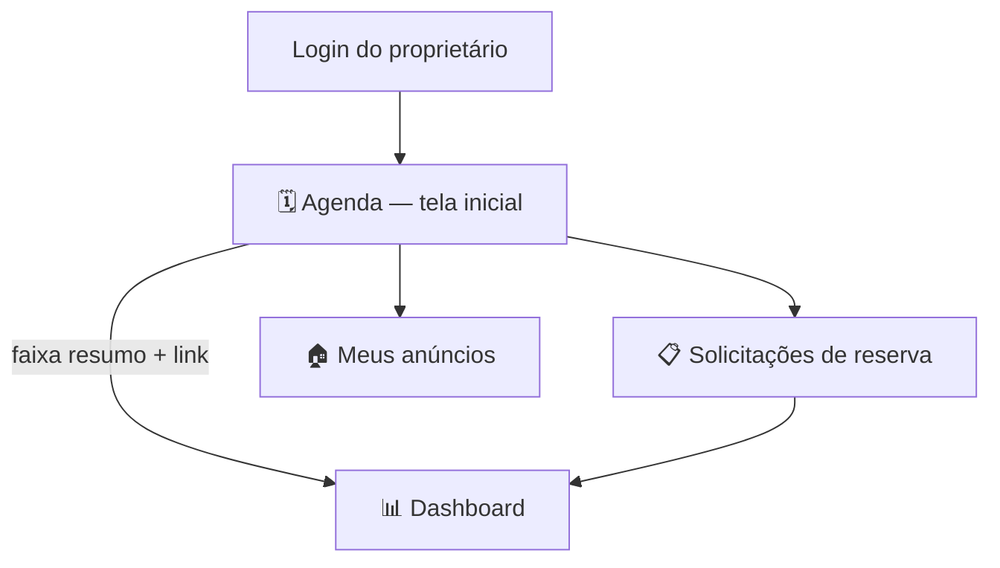

# Dashboard do Parceiro — Documentação da Feature

> Status: **rascunho em protótipo** — UI em `/painel` (aba "Dashboard" + faixa
> resumo na Agenda); ainda não formalizado nos docs oficiais. Depende do painel
> descrito em [`painel-proprietario.md`](./painel-proprietario.md).

## 1. Objetivo

Dar ao parceiro/proprietário uma visão de métricas e KPIs do próprio negócio
(faturamento, conversão, ocupação, mix de eventos, comodidades mais vendidas)
sem sair do painel de gestão que já existia — reaproveitando os dados que já
circulam em Agenda e Solicitações, sem criar uma fonte de dado nova.

## 2. Onde entra no painel

- **Aba "Dashboard"** no menu lateral, entre "Solicitações" e "Meus anúncios".
- **Faixa resumo** no topo da tela de Agenda: 3 números (Faturamento do mês,
  Ocupação, Pendentes) + link "Ver dashboard completo →". Não duplica o
  dashboard inteiro ali, só dá o "de relance" antes de trocar de aba.

## 3. Métricas incluídas

| Métrica | Fonte de dado | Observação |
|---|---|---|
| Faturamento (reservas aceitas) | soma de `estimatedTotal` das solicitações com status `aceita` | |
| Ticket médio | faturamento ÷ nº de reservas aceitas | — quando não há aceitas |
| Taxa de conversão | aceitas ÷ (aceitas + recusadas) | pendentes não entram na conta |
| Solicitações pendentes | contagem direta | mesmo número do badge da aba Solicitações |
| Ocupação da agenda | dias em `busyDates` + metade dos dias em `partialDates`, sobre uma janela de 30 dias | média entre espaços quando o parceiro tem mais de um |
| Funil da jornada | Visitas agendadas → Solicitações recebidas → Reservas confirmadas | funil operacional agregado, não é um rastreio de lead único ponta a ponta |
| Mix de tipos de evento | contagem de `eventType` em todas as solicitações | |
| Comodidades mais escolhidas | frequência das comodidades pedidas nas reservas aceitas + receita das que são pagas (`AmenityOffer.price`) | |
| Faturamento — últimos 6 meses | **dado simulado** (ver seção 5) | |
| Comparativo por espaço | mesmas métricas acima, por espaço | só aparece se o parceiro tiver mais de 1 espaço |

## 4. Decisão revisitada: Agenda x Dashboard

O [`painel-proprietario.md`](./painel-proprietario.md) já tinha fechado que
**"Agenda é a primeira tela... não um dashboard de métricas"**. Essa decisão
segue valendo — o Dashboard não virou a tela inicial nem foi fundido com a
Agenda. Para dar visibilidade sem contradizer isso, ficou definido:

1. Dashboard como **aba própria**, separada da Agenda.
2. Uma **faixa fina de resumo** (3 números) no topo da Agenda, com atalho —
   dá o "estado do negócio" de relance sem sobrecarregar a tela operacional.

Alternativas descartadas: fundir tudo numa página só (fica denso demais,
principalmente no mobile) e não linkar as duas telas (perde a visibilidade que
motivou o pedido).

## 5. Dado simulado — transparência

O gráfico "Faturamento — últimos 6 meses" **não é histórico real** — o
protótipo não guarda série temporal. Os 5 meses anteriores ao atual são
gerados por uma seed determinística (mesma entrada → sempre o mesmo gráfico),
e o mês atual usa o faturamento real calculado. A UI deixa isso explícito:

> *Meses anteriores ao atual são estimativas ilustrativas — o histórico real
> ainda não está disponível no protótipo.*

Quando houver reservas com data de criação/pagamento persistida, trocar a
simulação por agregação real mês a mês.

## 6. Arquivos tocados

- `src/lib/owner-dashboard-data.ts` — cálculo das métricas (`getDashboardMetrics`)
- `src/components/owner-dashboard.tsx` — UI do Dashboard (`OwnerDashboard`) e
  da faixa resumo (`AgendaSummaryStrip`)
- `src/components/owner-panel.tsx` — nova aba no menu + faixa resumo acima da
  Agenda

Nenhum dado novo foi inventado além do histórico simulado da seção 5 — tudo
mais deriva de `owner-panel-data.ts` e `mock-data.ts`, que já existiam.

## 7. Estado da implementação (protótipo)

- `/painel`: Agenda (com faixa resumo), Solicitações, **Dashboard**, Meus
  anúncios, Cadastrar.
- Sem paleta nova: cores reaproveitam os tokens já definidos em `styles.css`
  (`--color-primary`, `--leaf`, `--forest`, `--forest-deep`).
- Sem lib de gráfico: barras/funil/linha de tendência são SVG/HTML simples,
  sem dependência nova no `package.json`.

## 8. Relação com os docs existentes

- Painel base: [`painel-proprietario.md`](./painel-proprietario.md)
- Métricas de produto (nível ACIT, não por parceiro): [`../metricas-impacto.md`](../metricas-impacto.md)
- Dados de agenda/solicitações: [`../agenda-calendario.md`](../agenda-calendario.md), [`../reservas.md`](../reservas.md)

---
*Gerado a partir da conversa de definição de produto — reflete decisões até o
momento, sujeito a mudança até ser formalizado nos docs oficiais do
repositório.*
