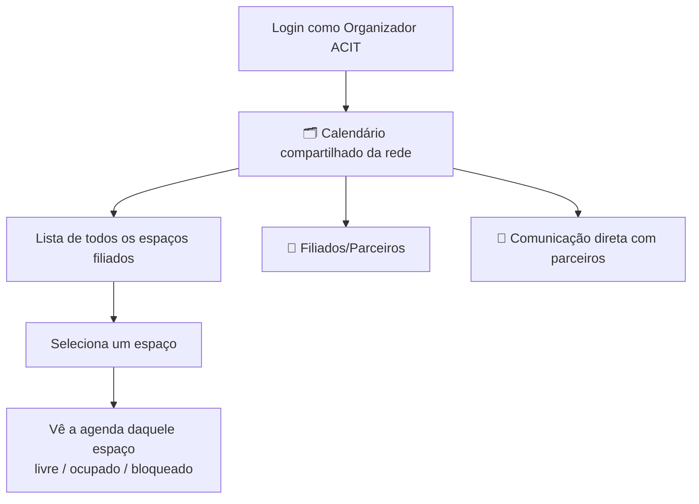

# Painel do Organizador (ACIT) — Calendários Compartilhados

> Status: **rascunho de discussão**, ainda não incorporado aos docs oficiais do projeto. Guardar aqui até fecharmos o desenho e decidirmos formalizar.
>
> **Este painel é separado do painel do proprietário.** `painel-proprietario.md`, `OwnerPanel` e `OwnerAgenda` continuam exatamente como estão — nada aqui propõe alterar esses arquivos. São dois papéis diferentes (`docs/usuarios-papeis.md`): **Espaço/núcleo** (proprietário, dono de um espaço) e **ACIT** (rede, enxerga todos os espaços). Cada um com seu próprio painel.

## 1. Objetivo

Dar ao **Organizador (ACIT)** — o papel institucional que governa a rede (Pilar 1 de `3-pilares-estrutura.md`) — uma visão de **calendário compartilhado**: os horários/datas de todos os espaços filiados, num painel próprio, distinto do painel do proprietário.

## 2. Onde isso vive (separado do proprietário)

| | Proprietário | Organizador (ACIT) |
|---|---|---|
| Painel | `OwnerPanel` (já existe) | Painel novo, próprio |
| Vê a agenda de | Só os espaços dele (`user.spaceSlugs`) | Todos os espaços da rede |
| Pode bloquear data | Sim | Não (só visualiza) |
| Pode aceitar/recusar reserva | Sim | Não |
| Rota | `/painel` | Rota própria (ex: `/painel-acit`) |

Nenhum componente é compartilhado entre os dois — o organizador tem sua própria tela de calendário, que só **lê os mesmos dados** (não a mesma interface).

## 3. Fluxo



## 4. Tela 1 (inicial) — Calendário compartilhado

```
🗂️ Calendário compartilhado — Rede ACIT (24 espaços)

┌─────────────────────────────────────────┐
│ Salão Vila Verde        🟢 Agenda em dia │
│ Toledo - PR             Última att: hoje │
├─────────────────────────────────────────┤
│ Espaço Corujas          🟡 Sem att há 9d │
│ Toledo - PR                              │
├─────────────────────────────────────────┤
│ Chácara Bela Vista      🔴 Sem att 20+d  │
│ Toledo - PR                              │
└─────────────────────────────────────────┘

[ Buscar espaço... ]
```

O indicador de "agenda desatualizada" dá à ACIT um jeito de fiscalizar a regra já existente em `docs/espacos.md` ("espaço sem agenda atualizada perde prioridade na busca").

## 5. Tela 2 — Agenda de um espaço (visão do organizador)

Uma tela própria do organizador (não o componente do proprietário) — mesma linguagem visual (verde/livre, vermelho/ocupado, amarelo/bloqueado), **sem nenhum botão de ação** (bloquear, aceitar, recusar):

```
🗓️ Salão Vila Verde — Calendário (somente leitura)

  Setembro 2026
  🟢 livre   🔴 ocupado   🟡 bloqueado pelo espaço

  15 SET — 🔴 Ocupado
  20 SET — 🟢 Livre

[ ← Voltar pro calendário compartilhado ]
```

## 6. Tela 3 — Filiados/Parceiros (gestão de homologação)

```
👥 Filiados/Parceiros

── Aguardando homologação (2) ──────────────
┌─────────────────────────────────────────┐
│ Espaço Corujas Coworking                 │
│ Cadastrado em 06/09/2026 · Toledo - PR   │
│ [ Ver cadastro completo ]                │
│ [ Homologar ]         [ Recusar ]        │
└─────────────────────────────────────────┘

── Verificados ─────────────────────────────
┌─────────────────────────────────────────┐
│ Salão Vila Verde                         │
│ ✓ Verificado ACIT                        │
│ [ Remover selo ]                         │
└─────────────────────────────────────────┘
```

### Como isso se conecta ao código já existente

O cadastro de espaço (`SpaceRegistrationWizard` + `src/lib/space-registration.ts`) já publica cada espaço novo com:

```ts
export type PublishedSpaceListing = {
  ...
  status: "aguardando_homologacao"; // hoje só existe este valor
  ...
};
```

Tudo fica no mesmo `localStorage` (`agora.mock.ownerListings`), só filtrado por `ownerId` na função `listOwnerListings`. Para o painel do organizador:

1. **Ampliar o tipo do status**: `"aguardando_homologacao" | "verificado" | "recusado"`
2. **Nova função de leitura**, sem filtro por dono: `listPendingHomologacoes()` — retorna todos os listings com `status === "aguardando_homologacao"`, de qualquer parceiro
3. **Nova função de escrita**: `updateListingStatus(listingId, status)` — usada pelos botões "Homologar" (→ `"verificado"`) e "Recusar" (→ `"recusado"`)
4. **Efeito visível pro parceiro**: a aba "Meus anúncios" do `OwnerPanel` já mostra o status do espaço — ao ser homologado, passa a exibir o selo "Verificado ACIT" automaticamente, sem o parceiro precisar fazer nada
5. **Efeito na busca/mapa**: um espaço `"verificado"` entra na **camada A** (destaque ACIT) descrita em `docs/mapa-busca.md` e `docs/parceiros-rede.md`; enquanto `"aguardando_homologacao"`, não aparece na busca pública ainda (só pro próprio dono, na aba Meus anúncios)

## 7. Tela 4 — Comunicação direta com parceiros

```
💬 Falar com parceiros

Selecionar espaço: [ Salão Vila Verde ▼ ]
[ campo de mensagem ]
[ Enviar ]
```

## 8. Decisões fechadas

1. **Painel do organizador é separado do painel do proprietário** — nenhuma alteração no `OwnerPanel`/`OwnerAgenda` existente
2. Organizador tem **acesso de leitura a todos os calendários de todos os espaços da rede**, não uma lista restrita
3. **Lista de espaços** como visão principal (não grade consolidada)
4. Organizador **não bloqueia data, não aceita/recusa reserva** — só visualiza
5. Organizador **aceita ou recusa a homologação** (selo de verificação) dos espaços recém-cadastrados — ação exclusiva dele, o parceiro só solicita ao publicar o cadastro

## 9. Relação com os docs existentes

- Papel institucional: `3-pilares-estrutura.md` (Pilar 1 — Organizador ACIT)
- Papéis do produto: `docs/usuarios-papeis.md`
- Painel do proprietário (intocado): `docs/rascunhos/painel-proprietario.md`
- Regra de agenda desatualizada: `docs/espacos.md`
- Cadastro/status de homologação: `src/lib/space-registration.ts`, `formulario-cadastro-espaco.md`
- Selo/destaque na busca: `docs/mapa-busca.md`, `docs/parceiros-rede.md`

---
*Gerado a partir da conversa de definição de produto — reflete decisões até o momento, sujeito a mudança até ser formalizado nos docs oficiais do repositório.*
