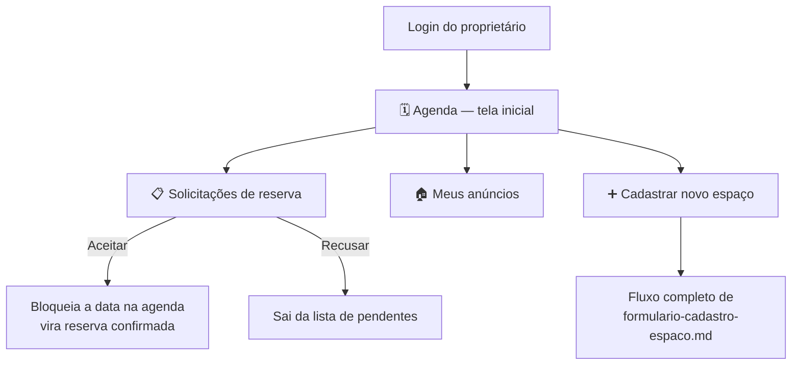

# Painel do Proprietário — Documentação da Feature

> Status: **rascunho em protótipo parcial** — UI em `/painel`; ainda não formalizado nos docs oficiais.

## 1. Objetivo

Definir a estrutura do painel que o proprietário/núcleo vê ao logar — a área de gestão do(s) espaço(s) dele, cobrindo: agenda, solicitações pendentes, anúncios já publicados e cadastro de novos espaços.

## 2. Estrutura do painel (menu lateral)



**Nota de nomenclatura:** esta seção trata de **pedidos de reserva de evento** (que exigem aceite e, ao serem aceitos, ocupam uma data na agenda) — não confundir com a feature **Agendar Visita** (`agendar-visita.md`), que é um pedido informal, sem aceite e sem bloqueio de agenda, encaminhado direto ao WhatsApp do proprietário.

## 3. Tela 1 (inicial) — Agenda

Layout inspirado no Google Calendar (simplificado): grade mensal com chips de evento no dia.

```
🗓️ Agenda — Salão Vila Verde          [ Sincronizar Google ]

  Setembro 2026
  Dom Seg Ter Qua Qui Sex Sáb
  … chips coloridos nos dias …

  Livre (sem cor) · Reserva feita (verde) · Visita marcada (azul) · Bloqueado por mim (vermelho)

[ Bloquear uma data manualmente ]
```

- Clicar num dia mostra eventos (reserva / visita) ou permite bloquear
- **Sincronizar Google** = atalho mock para espelho opcional no Google Calendar (fonte de verdade continua na plataforma) — ver [agenda-calendario.md](../agenda-calendario.md)

## 4. Tela 2 — Solicitações de reserva (pendentes)

```
📋 Solicitações pendentes (3)

┌─────────────────────────────────────────┐
│ João Silva — 15/09/2026 — Aniversário    │
│ 80 convidados                            │
│ Comodidades: Cascata de chocolate, Coffee│
│ Total estimado: R$ 1.930                 │
│                                           │
│ [ Aceitar ]        [ Recusar ]           │
└─────────────────────────────────────────┘
```

- Ao **aceitar**: a data trava automaticamente na Agenda (Tela 1) como "ocupado" — reserva confirmada, sem precisar repetir a ação em dois lugares
- Ao **recusar**: sai da lista de pendentes, não ocupa a agenda
- Mostra os dados já coletados no fluxo de pedido: data, tipo de evento, capacidade, comodidades selecionadas e total estimado (`docs/comodidades.md`, `docs/reservas.md`)

## 5. Tela 3 — Meus anúncios

```
🏠 Meus anúncios

┌───────────────────────────────┐
│ [foto] Salão Vila Verde        │
│ Ativo · Verificado ACIT        │
│ [ Editar ]                     │
├───────────────────────────────┤
│ [foto] Espaço Corujas Coworking│
│ Aguardando homologação         │
│ [ Editar ]                     │
└───────────────────────────────┘

[ + Cadastrar novo espaço ]
```

- Lista todos os espaços que aquele proprietário já cadastrou, com status (ativo/verificado ACIT/aguardando homologação)
- **"Editar"** reabre os mesmos campos do cadastro (assistido por Google ou manual), pré-preenchidos com os dados atuais

## 6. Tela 4 — Cadastrar novo espaço

Aciona **exatamente** o fluxo já documentado em [`formulario-cadastro-espaco.md`](./formulario-cadastro-espaco.md) — busca Google/manual → revisão dos dados → dados PigData (capacidade, classes, tipos de evento) → atributos de infraestrutura → comodidades → fotos → preço/regras → revisão final → publicar. Nenhuma tela nova é reinventada aqui — é o mesmo fluxo, só acessado a partir do painel em vez do cadastro inicial de conta.

## 7. Decisões já fechadas nesta conversa

1. **Agenda é a primeira tela** que o proprietário vê ao logar (não uma lista de pedidos, não um dashboard de métricas)
2. **"Solicitações" = pedidos de reserva de evento**, distintos dos pedidos de "Agendar Visita" — os primeiros exigem aceite e bloqueiam agenda; os segundos não
3. **Aceitar uma solicitação bloqueia a data automaticamente** na agenda — uma ação só, sem passo duplicado
4. **Cadastrar novo espaço reaproveita 100% o fluxo já documentado**, sem criar um formulário paralelo

## 8. Relação com os docs existentes

- Agenda: `docs/agenda-calendario.md`
- Solicitações/reserva: `docs/reservas.md`, `docs/comodidades.md`
- Cadastro/edição de espaço: `formulario-cadastro-espaco.md`, `docs/cadastro-assistido-google.md`, `docs/espacos.md`
- Distinção com visita informal: `agendar-visita.md`

## Estado da implementação (protótipo)

- `/painel`: Agenda, Solicitações, Meus anúncios, Cadastrar.
- **Cadastrar** abre o fluxo de `formulario-cadastro-espaco.md` (wizard completo mock).
- **Meus anúncios** lista espaços mock da conta + publicações locais (`listOwnerListings`).
- Parceiro acessa o **mapa** (`/`) pela topbar (Mapa / logo), além do painel.

---
*Gerado a partir da conversa de definição de produto — reflete decisões até o momento, sujeito a mudança até ser formalizado nos docs oficiais do repositório.*
