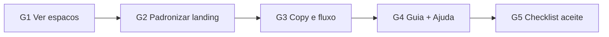

# Planejamento — Pacote Gabriel (UX, home e fluxo)

> **Status:** implementado (2026-09-14)  
> **Data:** 2026-09-14  
> **Backlog:** [backlog-equipe.md](./backlog-equipe.md) · itens G1–G5  
> **Escopo:** correção e clareza de UX na landing + guia; **não** inclui T07+ (acompanhamento/pagamento) nem remoção do organizador (R2 — Rafael)

## 1. Diagnóstico resumido

| ID | Achado |
|----|--------|
| G1 | Em [`src/routes/bem-vindo.tsx`](../../src/routes/bem-vindo.tsx), **Ver espaços** é `<a href="#preview">` (scroll na landing). O mapa em `/` exige sessão (`beforeLoad` em [`src/routes/index.tsx`](../../src/routes/index.tsx)). Já existe o padrão correto em **Abrir mapa**: `loginAsMock("cli-ana")` + `Link to="/"`. |
| G2 | Três blocos com ritmos diferentes (hero / preview / sand); CTAs concorrentes (Entrar, Ver espaços, SearchBar, Abrir mapa). |
| G3/G5 | Fluxo cliente documentado em `fluxo-telas.md` (T01–T12); protótipo cobre ~T01–T06. Visitante não chega ao mapa sem login silencioso ou `/entrar`. Sem orientação in-app. |
| G4 | Nenhum guia/ajuda na UI. Painel admin do parceiro: `/painel`. Organizador `/painel-acit` pode sair (R2) — guia não deve depender dele. |

## 2. Decisões deste plano (defaults)

1. **G1 — destino de Ver espaços:** levar ao **mapa** (`/`), reutilizando o padrão demo já usado em Abrir mapa e SearchBar: `loginAsMock("cli-ana")` + navegação para `/`.  
   - **Não** abrir mapa anônimo nesta etapa (exigiria mudar o gate de `/`).  
   - **Não** forçar só `/entrar` no CTA secundário (piora a demo da banca).  
2. **Hierarquia de CTAs no hero:** **Ver espaços** = ação de explorar o produto (mapa); **Entrar** = escolher conta (cliente/parceiro). Remover ou fundir o botão duplicado **Abrir mapa** da seção preview (mesmo destino).  
3. **Seção `#preview`:** manter cards como prova social / amostra; o CTA principal do hero deixa de ser “só scroll”. Opcional: link textual “Ver amostra abaixo” se ainda quiser âncora.  
4. **G4 — formato do guia:** documento oficial [`docs/guia-usuario.md`](../guia-usuario.md) (banca + equipe) + entrada leve **Ajuda** no painel do parceiro (`/painel`) apontando para o mesmo conteúdo (painel/drawer ou rota simples `/ajuda`). Foco administrativo = **parceiro**; organizador só em nota “legado / sujeito a R2”.  
5. **G5:** critério de aceite = checklist no guia (caminho cliente + caminho parceiro sem explicação oral). Coordenar com Amabilly (A3/A4), sem duplicar outro doc.

## 3. Entregas por item

### G1 — Corrigir Ver espaços → mapa

**Arquivos**
- [`src/routes/bem-vindo.tsx`](../../src/routes/bem-vindo.tsx) — trocar `#preview` pelo mesmo padrão de Abrir mapa; alinhar labels.
- [`src/components/site-footer.tsx`](../../src/components/site-footer.tsx) — se o link “Buscar espaços” / similar cair em `/` sem sessão, aplicar o mesmo padrão ou `/entrar`.
- Docs: [`docs/fluxo-telas.md`](../fluxo-telas.md) (T01→T02 no protótipo), status G1 no backlog.

**Comportamento esperado**
1. Visitante em `/bem-vindo` clica **Ver espaços**.  
2. Sessão mock cliente (Ana) é criada.  
3. Navega para `/` (mapa).  
4. Não volta para a landing por redirect.

### G2 — Padronizar linhas da página inicial

**Arquivos:** principalmente `bem-vindo.tsx`; utilitários em [`src/styles.css`](../../src/styles.css) só se fizer sentido (ex.: classe de seção).

**Mudanças concretas**
- Unificar ritmo vertical das seções (ex.: `py-16 md:py-20` nas seções abaixo do hero).
- Uma hierarquia tipográfica: H1 no hero; H2 nas seções; H3 nos três pilares.
- Reduzir clutter de CTAs: hero com Entrar + Ver espaços; SearchBar como busca; preview sem segundo botão redundante para o mapa (ou só “Ver no mapa” se necessário após G1).
- Ícones distintos nos três pilares (hoje os três usam `ShieldCheck`).
- Manter identidade visual existente (não redesenhar do zero).

### G3 — Primeira tela e fluxo compreensível

**Landing**
- Bloco curto “Como funciona” (3 passos alinhados ao produto): buscar data → solicitar sem pagar → reserva só após aprovação. Pode reaproveitar/refinar a seção sand.
- Microcopy que deixe explícito: explorar o mapa entra como **cliente demo** (ou equivalente honesto para a banca).

**Documentação**
- Atualizar `fluxo-telas.md` com nota de protótipo: o que está clicável (T01–T06) vs. ainda não (T07+).
- Opcional: diagrama mermaid visitante → mapa → detalhe → solicitação → painel parceiro.

**Fora de escopo G3:** implementar telas T07+ (acompanhamento, pagamento, minhas reservas).

### G4 — Guia do usuário (foco administrativo)

**Novo:** [`docs/guia-usuario.md`](../guia-usuario.md)

Conteúdo mínimo:
1. Contas demo e senha.  
2. Caminho do **cliente** (bem-vindo → mapa → espaço → solicitar).  
3. Caminho do **parceiro** (`/painel`): Agenda, Solicitações (aceitar/recusar), Anúncios, Cadastrar.  
4. O que *não* pedir na demo (pagamento real, Places real, etc.).  
5. Nota sobre organizador ACIT / R2.

**UI mínima:** link/botão **Ajuda** no topbar ou cabeçalho de `/painel` → `/ajuda` ou drawer com o essencial do guia (mesmo texto, versão curta).

### G5 — Usar sem explicação (critério)

Incluir no guia (e espelhar no backlog) um **checklist de aceite**:

| # | Pessoa sem briefing consegue… | Depende de |
|---|-------------------------------|------------|
| 1 | Da landing chegar ao mapa e ver espaços | G1 |
| 2 | Entender solicitação ≠ reserva pela própria UI | G2/G3 |
| 3 | Enviar uma solicitação mock | já existe (T04–T06) |
| 4 | No parceiro, achar e aceitar/recusar solicitação | G4 |
| 5 | Saber qual conta demo usar sem perguntar ao grupo | G4 |

Falhas do checklist alimentam ajustes de copy/CTA, não features novas fora deste pacote.

## 4. Ordem de implementação sugerida

1. G1 (bug bloqueante da demo)  
2. G2 (mesma página, visual)  
3. G3 (clareza / docs de fluxo)  
4. G4 (guia + entrada no painel)  
5. G5 (validar checklist; ajustar se falhar)

## 5. Docs a atualizar na implementação

| Arquivo | Motivo |
|---------|--------|
| `docs/rascunhos/backlog-equipe.md` | Status G1–G5 → em andamento / feito |
| `docs/fluxo-telas.md` | T01 CTA → mapa; nota protótipo |
| `docs/guia-usuario.md` | **novo** |
| `docs/mvp.md` | Se o caminho visitante→mapa mudar a narrativa do slice |
| `README.md` | Link do guia no mapa de documentos |
| `docs/IMPLEMENTACAO.md` | Registro da entrega |
| `docs/rascunhos/README.md` | Este planejamento |

## 6. Critérios de pronto (pacote Gabriel)

- [x] Clicar **Ver espaços** abre o mapa (sessão cliente demo).  
- [x] Landing com ritmo/CTA coerentes; sem botões duplicados para o mesmo destino.  
- [x] Visitante entende o fluxo em ≤3 passos na própria UI.  
- [x] Existe `docs/guia-usuario.md` + acesso Ajuda no painel do parceiro.  
- [x] Checklist G5 no guia e em `/ajuda`.  
- [x] Docs e `IMPLEMENTACAO.md` atualizados.

## 7. Riscos / dependências

| Risco | Mitigação |
|-------|-----------|
| Login silencioso como Ana pode confundir a banca | Microcopy honesta no CTA / após entrar no mapa |
| R2 remove organizador | Guia foca parceiro; organizador só nota |
| Amabilly A3/A4 | Compartilhar o checklist G5; não criar segundo checklist paralelo |
| Footer → `/` sem sessão | Corrigir junto com G1 |

## 8. Próximo passo

Validar este planejamento (especialmente a decisão do **login mock no Ver espaços**). Com OK, implementar na ordem da seção 4.
